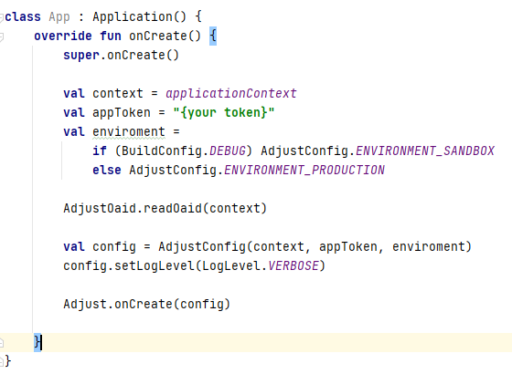

# HMS ve OAID İşlemleri
OAID ile üçüncü parti takip platformları entegrasyonu ve panel işlemleri ile kullanıcı aksiyonları takip işlemleri

<hr>

</br>
</br>

## **Başlamadan Önce**

</br>

### **Üçüncü Parti Takip Platrformu Nedir?**

<p>
Bir şirket (kampanya, tanıtım, duyuru vb. gibi) pazarlama işlemleri için reklam yayınladığında, bütçesini en iyi şekilde yönetmek için kullanıcıların bu reklam ile nasıl etkileşime geçtiğini (örn: reklama kaç kullanıcı tıkladı, kaç kullanıcı reklamdan gelerek uygulamayı indirdi, kaç kullanıcı reklamdan gelerek ürün satın aldı vb. ) detaylarıyla görmek ister. Bu, kullanıcı ve kullanıcı davranışlarının takibinin baz alındığı bir dizi işlemleri gerektirir.

Adjust, AppsFlyer, Kochava, Sizmek gibi platformlar bu konuda hizmet vermektedir.
</p>

</br>

### **OAID Nedir?**
<p>
MSA'nın (Mobile Security Alliance) Çin tarafından üretilen tüm cihazların sağlaması gerektiğini duyurduğu bir reklam kimliğidir.

Google Play Hizmetlerinin olmadığı diğer uygulama mağazalarında, Android cihazları takip etmek için kullanılır.

HMS (Huawei Mobil Servisleri) kullanan tüm cihazlarda OAID kolay bir şekilde erişilebilir durumdadır.
</p>

</br>

<hr>

## **HMS & Adjust**
1. Client Taraflı İşlemler
   1. [OAID için SDK'in Uygulamanıza İmplemente Edilmesi](#adjust-sdk)
   2. [Adjust.readOaid() Methodu ile OAID değerinin Adjust'a Bildirilmesi](#adjust-oaid-values)
   3. [Adjust.trackEvent() Methodu ile Olay Takibi](#track_event)
2. Panel Taraflı İşlemler
   1. [Adjust Panel'de Huawei Ads için Takipçi Oluşturulması](#create_follower)
   2. [Click ve Impression URL'lerinin Oluşturulması](#click_impression)
   3. [Huawei Ads Panel'de Adjust için Ortalık Oluşturulması](#Huawei_ads)
   4. [SecretKey Değerinin Adjust Panel'e Girilmesi](#secretkey)
   5. [Huawei Ads Panel'de Dönüşüm Takibi Oluşturulması](#conversion_tracking)
   6. [Adjust Panel'de Dönüşümleri Takip Edecek Olayların Oluşturulması ve Linklenmesi](#event_linking)
   7. [Huawei Ads Panel'de Dönüşüm Takibi İçin Test İşlemlerinin Yapılması](#conversion_test)
3. [Adjust Sıkca Sorulan Sorular](#adjust-sss)
4. [Kaynakça](#reference)

</br>
</br>

## **HMS & AppsFlyer**
1. Client Taraflı İşlemler
   1. OAID için SDK'in Uygulamanıza İmplemente Edilmesi
   2. ...
   3. ...
2. Panel Taraflı İşlemler
   1. AppsFlyer Panel'de Huawei Ads için Takipçi Oluşturulması
   2. Click ve Impression URL'lerinin Oluşturulması
   3. Huawei Ads Panel'de AppsFlyer için Ortalık Oluşturulması
   4. SecretKey Değerinin AppsFlyer Panel'e Girilmesi
   5. Huawei Ads Panel'de Dönüşüm Takibi Oluşturulması
   6. AppsFlyer Panel'de Dönüşümleri Takip Edecek Olayların Oluşturulması ve Linklenmesi
   7. Huawei Ads Panel'de Dönüşüm Takibi İçin Test İşlemlerinin Yapılması
3. Sıkca Sorulan Sorular
4. Kaynakça

</br>
</br>


# **Adjust**

</br>

## **Client Taraflı İşlemler**
<p>
Adjust ve OAID işlemleri için öncelikle uygulama taraflı olan işlemleri tamamlamamız gerekmektedir. 

Bu işlemler; SDK implemente etmek, test için fonksiyon oluşturmak gibi basit bir kaç adımda tamamlanmaktadır.
</p>

</br>

## <a name="adjust-sdk"></a> **1. OAID için SDK'in Uygulamanıza İmplemente Edilmesi**

<p>
app:build.gradle dosyanızda Adjust SDK bağımlılığının altına şu implementation satırını eklemelisiniz; 

```
implementation 'com.adjust.sdk:adjust-android:4.28.8'
implementation 'com.adjust.sdk:adjust-android-oaid:4.28.8'
```
</br>


</p>

</br>

## <a name ="adjust-oaid-values"></a> **2.Adjust.readOaid() Methodu ile OAID değerinin Adjust'a Bildirilmesi**

<p>
Uygulamanızda Adjust.onCreate(config) ile SDK işlemlerini başlattığınız satırın üstüne OAID değerini okumak için olan şu satırı eklemelisiniz;

```
AdjustOaid.readOaid(applicationContext)
Adjust.onCreate(config)
```
</br>



</p>

</br>

<p>
Adjust’ın sağladığı SDK ile OAID değerini doğru şekilde aldığınızı kontrol etmelisiniz. Bunun için şu kodları kullanıp;

Java
```java
Context context = applicationContext;
String appToken = «{your token}»;
String environment =  
   if (BuildConfig.DEBUG) AdjustConfig.ENVIRONMENT_SANDBOX;
   else AdjustConfig.ENVIRONMENT_PRODUCTION;

AdjustOaid.readOaid(context);

AdjustConfig config = new AdjustConfig(context, appToken, environment);
config.setLogLevel(LogLevel.VERBOSE);

Adjust.onCreate(config);
```


Kotlin
```kotlin
val context = applicationContext
val appToken = "{your token}"
val environment =
   if (BuildConfig.DEBUG){
       AdjustConfig.ENVIRONMENT_SANDBOX 
   }
   else{
      AdjustConfig.ENVIRONMENT_PRODUCTION
   } 
AdjustOaid.readOaid(context)
val config = AdjustConfig(context, appToken, environment)
config.setLogLevel(LogLevel.VERBOSE)
Adjust.onCreate(config)
```
</p>

</br>

<p>
LogCat penceresinde Verbose seviyesindeki logları dinleyip, «oaid» şeklinde filtreleme yaptığınızda;

```
get oaid from:{package-name}
```

Şeklindeki satırları görmeniz gerekmektedir.

</br>


</p>

</br>

## <a name="track_event"></a> **3.Adjust.trackEvent() Methodu ile Olay Takibi**

<p>
Uygulama içerisinde yapmamız gereken bir diğer önemli işlem ise; Adjust Panelde oluşturulan olayları takip etmek için ilgili token’ların doğru yerlerde trackEvent methoduna parametre olarak verilme işlemidir.

</br>


Java
```java
AdjustEvent adjustEvent = new AdjustEvent("abc123");
Adjust.trackEvent(adjustEvent);
```
Kotlin
```kotlin
val adjustEvent = AdjustEvent("abc123")
Adjust.trackEvent(adjustEvent)
```
</p>


## **Client Taraflı İşlemler**
<p>
Adjust ile Huawei Reklam Servisinin birlikte çalışabilmesi için hem Adjust hem de Huawei Ads Panellerinde bazı işlemler yapmamız gerekir. Öncelikle Adjust Panel taraflı işlemlerle başlayalım.
</p>

</br>

## <a name="create followers"></a> **1.Adjust Panel'de Huawei Ads için Takipçi Oluşturulması**

<p>
Adjust Panel’e giriş yaptıktan sonra yeni bir takipçi oluşturalım ve bunu Huawei Ads olarak isimlendirelim. Bunun için;
</p>

</br>

<p>
Tracker URLs -> New Tracker -> Enter Tracker Name ‘e gidin ve “华为 广告 | Huawei Ads“ olarak isimlendirin.

</br>


</p>

</br>

## <a name="click impression"></a> **2. Click ve Impression URL'lerinin Oluşturulması**

<p>
Ardından CUSTOMIZE -> CREATE ‘e tıklayın.

Click ve Impression URL’leri sırasıyla oluşacaktır.

Not: Bu URL’leri Huawei Ads Platformuna eklenmek üzere not etmeyi lütfen unutmayın.

</br>


</p>

</br>

## <a name="Huawei Ads Panel"></a> **3.Huawei Ads Panel'de Adjust için Ortalık Oluşturulması**

<p>
Huawei Ads Panel’e giriş yaptıktan sonra Adjust ile birlikte çalışacak alt yapıyı kurmak üzere bir ortaklık oluşturmakla başlayalım. Bunun için;

Tools > Delivery assistance > Associated tool menüsüne gidin ve New’e tıklayın.

</br>


</p>

</br>

<p>
Açılan sayfada;

   -Tool provider olarak Adjust’ı,

   -App olarak ilgili uygulamanızı seçiniz.

   -Impression tracking URL ve Click tracking URL alanlarını Adjust Panelden aldığınız URL’ler ile doldurun ve Submit butonuna tıklayın.


</p>

</br>

<p>
Submit işleminden sonra karşınıza gelen listede bulunan Key değerini Adjust Panel’e eklememiz gerekiyor. 

</br>


</p>

</br>

## <a name="Secretkey"></a> **4.SecretKey Değerinin Adjust Panel'e Girilmesi**

<p>
Adjust Panel’e geri dönelim ve Partner Setup -> Add Partner ‘e gittikten sonra Huawei Ads’i arayalım.

Uygulama platformu doğru şekilde seçtikten sonra SECRETKEY alanına bir önceki aşamada aldığımız Key’i girip Save butonuna tıklayalım.

</br>


</p>

</br>

## <a name="Conversion_tracking"></a> **5.Huawei Ads Panel'de Dönüşüm Takibi Oluşturulması**

<p>
Takip ve analiz edilmesi istenen dönüşüm aksiyonlarını hem Huawei Ads Paneline hem de Adjust paneline tanımlamamız gerekiyor. Öncelikle Huawei Ads Paneline geçelim;

   -Tools > Delivery assistance > Conversion tracking menüsünde bulunan New conversion’a tıklayalım.

   -Önce App tracking’i sonra Analysis tool’u seçelim ve Contiune butonuna tıklayarak devam edelim.

   -Karşımıza çıkacak olan formu doldurarak takip etmek istediğimiz aksiyonlar için dönüşüm oluşturalım.

   </br>

   

</p>

</br>

<p>
   -App: Takip etmek istediğiniz uygulamanızı seçiniz.

   -Conversion actions: Hangi konularda dönüşüm aksiyonları almak istediğinizi seçin.

   -Conversion name: Oluşturmak üzere olduğunu dönüşüme kolay anlaşılabilir bir isim verin.

   -Click attribution window: Reklam tıklandıktan ve dönüşüm oluşturulduktan sonraki periyottur. Varsayılan değeri 30 gündür ve bu değer Submit işleminden sonra değiştirilemez.

   -Display attribution window: Dönüşümün başlatılmasını sağlayan reklam izlenimi sonrası periyottur. Varsayılan değeri 1 gündür ve bu değer Submit işleminden sonra değiştirilemez.

   -Including Conversion Num: Dönüşüm aksiyonları için tanımladığınız her bir aksiyon için sayaç değeri tanımlayabilirsiniz. Örneğin uygulamanızda sepete ekleme işlemi 3, satın alma işlemi 2 kez gerçekleştiyse Conversion Num değeri size 5 olarak dönecektir.
</p>

</br>

<p>
Conversion actions tablosu:

</br>


Tümü için bakınız;
https://developer.huawei.com/consumer/en/doc/distribution/promotion/tracking-shu-0000001139892541#EN-US_TOPIC_0000001139892541__table10838115914391 

</p>

</br>

<p>
Eklediğiniz her Conversion için Status sütunu altında «Unactivated» durumunu göreceksiniz. Bu durum şu an için normaldir, aktivasyon işlemine ilerleyen aşamalarda başlamış olacağız.

</br>


</p>

</br>

## <a name="event_linking"></a> **6.Adjust Panel'de Dönüşümleri Takip Edecek Olayların Oluşturulması ve Linklenmesi**

<p>
Huawei Ads Panel’e eklenen dönüşüm aksiyonlarının Adjust Panel’ine de eklenmesi gerekmektedir.

Bunun için Adjust Panel’e geri dönmeli ve Partner Setup -> Add Partner alanında “华为广告 | HUAWEI Ads” i bulup seçmeliyiz ve aksiyonları birbirine eşitlemek için Event Linking alanını kullanmalıyız.

</br>


</br>

Not: Adjust «Install» olayını otomatik eklediği için sizin ayrıca eklemeniz gerekmez.

Not 2: Adjust tarafındaki «Install» olayı Huawei Ads Panel tarafındaki «Activation» olayına karşılık gelmektedir.

</p>

</br>

## <a name="conversion_test"></a> **7.Huawei Ads Panel'de Dönüşüm Takibi İçin Test İşlemlerinin Yapılması**

<p>
Eklediğiniz her Conversion için «Unactivated» olan durumunu aktive etmek için öncelikle Test işlemine tabii tutmamız gerekiyor bunun için ilgili satırın sağında bulunan Test linkine tıklıyoruz.

</br>


</p>

</br>

<p>
Açılan ekranda sizden test etmek istediğiniz cihazın OAID değerini girmenizi isteyecek. 

</br>


</br>

Bu değeri Huawei cihazınızda şu yolu takip ederek bulabilirsiniz;

Privacy -> Ads and Privacy -> More information

</br>


</br>

Burada gördüğünüz Ad-ID sizin OAID’inizdir.

</p>

</br>

<p>
İkinci aşamada sizden QR’u okutup uygulamayı indirmenizi isteyecektir. Bu işlemi tamamlayıp cihazınızdan uygulamayı açmanız gerekmektedir. 

</br>


</p>

</br>

<p>
Üçüncü ve son aşama sizden test etmek istediğiniz Conversion’ı uygulama içerisinde tetiklemenizi bekler. Örneğin «addToCart» için bir dönüşüm eklediyseniz uygulama içerisinde bir ürünü sepete ekleyerek bu dönüşümü test etmeniz gerekir. Test işlemi tamamlandıktan sonra conversion (dönüşüm) aktif hale gelecektir.

</br>


</p>

</br>

## <a name="adjust-sss"></a> **Adjust Sıkça Sorulan Sorular**


<p>
- Conversion testi aktif edilemiyor. Ne yapmalıyım?


+ Eğer bir Conversion (dönüşüm) aktive edilemiyorsa, test öncesi cihazınızın OAID değerini sıfırlayabilir ya da daha önce test için kullanılmamış bir cihaz ile test işlemini yeniden gerçekleştirmeyi deneyebilirsiniz.
</p>

</br>

<p>
- MSA’nın SDK’ini uygulamama implemente etmem gerekiyor mu?

+ Çin anakarası dışında yayınlanan uygulamalar için MSA’nın SDK’ini uygulamaya implemente etme gerekliliği yoktur. Adjust, AppsFlyer gibi şirketlerin sunduğu ek SDK’ler sayesinde HMS cihazlarda OAID verisine kolayca ulaşabilmektedir.
</p>

</br>

<p>
- Google tarafında bugüne kadar sorunsuz ilerliyorduk, şimdi neden OAID işlemlerini yapmamız gerekiyor?

+ GMS Core’a sahip cihazlarda cihaz ve kullanıcı aksiyonları takibi GAID (Google Ad ID) üzerinden yapılmaktadır. 2020 yılı sonrası üretilen Huawei cihazlarda GMS Core olmadığı için aynı işlemler HMS Core’a sahip cihazlar için OAID üzerinden yapılmalıdır.
</p>

</br>

<p>
- OAID entegrasyonu yapmak uygulama boyutumu yükseltir ya da performansını kötü yönde etkiler mi?

+ AppsFlyer, Adjust gibi takip platformlarının sunduğu OAID SDK’larının amacı sadece cihazdaki OAID verisine ulaşıp kendi core yapılarına bu veriyi taşımaktır. Bu sebeple oldukça hafif boyutlardadırlar.

+ Örneğin: AppsFlyer OAID SDK’i sadece 11 KB boyutundadır. Adjust için ise OAID işlemlerini yapan SDK’ın boyutu sadece 15 KB civarındadır.
</p>

</br>

<p>
- OAID işlemlerini yaptıktan sonra GMS cihazlarda test ederken log ekranında neden uyarı alıyorum?

+ OIAD işlemleri sadece HMS Core üzerinde çalışmaktadır. Bu yüzden HMS Core’a sahip olmayan cihazlarda bu uyarının görünmesi çok normaldir ve bir sorun olduğu anlamına gelmemektedir.
</p>

</br>

<p>
- Huawei Ads Panel ile Adjust Panel’deki Install sayıları birbirini neden tutmuyor?

+ Adjust Panel’de ki “install” sayılarını Huawei Ads Panel’de ki “activation” alanı ile karşılaştırmamız gerekmektedir.
</p>

</br>

<p>
- Huawei Panel’de ki “Activation” ne anlama gelmektedir?

+ <b>Download:</b> Reklam tıklanması sonucu, uygulamayı indirilme sayısı.

+ <b>Install:</b> Reklam tıklanması sonucu, indirilme sonrası uygulama yüklenme sayısı.

+ <b>Activation:</b> Reklam tıklanma sonucu, indirilme ve yüklenme sonrası uygulamanın ilk kez açılma sayısı.

+ Uygulama indirilme ve yüklenme işlemlerinde uygulama çalışmamış / ayağa kalkmamış durumunda olduğu için Download ve Install değerlerini HMS Core ile Huawei Ads Panel üzerinden takip edebiliyoruz. Adjust ise Huawei için Activation olan olayı Install (yani başarıyla yüklenme) olarak adlandırmaktadır.

</p>

</br>

<p>
- Adjust Panelinde “install” için bir event’i neden göremiyorum?

+ Install event’i Adjust Panelinde otomatik olarak eklenmiş / tanımlanmış olduğu için event listesinde görüntülenmemektedir.

</p>

</br>

<p>
- Hem HMS hem de GMS servislerine sahip telefonlarda kullanıcının reklama tıklamasından sonraki yönlendirme işlemleri nasıl çalışacak?

+ Bu reklamın hangi sağlayıcıdan sağlandığı ile alakalı bir durumdur. Kullanıcının gördüğü ve tıkladığı reklamın sağlayıcısı Huawei ise, tıklama işleminden sonraki takip ve yönlendirme işlemleri Huawei için eğer reklam diğer bir sağlayıcıdan sağlanıyor ise bu işlemler o sağlayıcı için devam edecektir.

</p>

</br>

<p>
- AppGallery ile 3. Parti Takip Platformu panel sayıları birbirini neden tutmuyor?

+ Bu olayın bir çok sebebi olabilir. Örnek vermek gerekirse bir kullanıcı aynı Huawei hesabı ile hem telefonuna hem de tabletine uygulamanızı indirebilir. Bu Adjust gibi 3. Parti Takip platformları tarafında 2 indirme sayılırken mağaza tarafında 1 indirme sayılır.

+ Ya da başka bir örnekle eğer uygulamanız daha önceden 3. Parti Takip Platformu SDK’ini yüklemeden mağazaya çıkmışsa, daha sonra 3. Parti Takip Platformu entegre edip güncelleme çıktığında 3. Parti Takip Platformu tarafında tüm eski kullanıcılar yeni kullanıcı olarak sayılacaktır, market tarafında ise bu güncelleme olarak görülecektir.

+ Dolayısıyla market tarafında eski kullanıcılar yeni gibi görünmeyecektir. Bu sebeple uygulamanın büyüklüğüne göre ilk güncelleme sonrası haftalar, aylar boyunca sayılarda tutarsızlık olabilir.

</p>

</br>

<p>
- SDK implementasyonu yapılmasına rağmen neden sadece organik install sayıları gözüküyor?

+ Bu durum büyük ihtimalle; Huawei Ads Panel ve üçüncü parti takip platformu arasındaki panel bağlantılarının yanlış yapılandırılmasından kaynaklanıyor olabilir.

+ Ayrıntılı bilgi için dokümandaki paneller arası işlemlerin tanıldığı kısımlara ve üçüncü parti takip platformlarının kendi dokümanlarını inceleyebilirsiniz.

</p>

</br>

<p>
- Neden Huawei Ads platformu ile 3. Parti takip platformlarının impression ve click sayıları farklı?

+ Click veya impression verileri, HUAWEI Ads SDK ile entegre edilmiş medya tarafından HUAWEI Ads’e ve üçüncü taraf izleme platformuna aynı anda bildirilir. Ağ paket kaybı olduğunda veri farkı oluşabilir. % 5 ile %10 arasındaki sayı tutarsızlığı normal olarak kabul edilir.

</p>

</br>

<p>
- Üçüncü parti takip platformundaki veriler neden HUAWEI Reklam raporlarındaki verilerden farklı?

+ Üçüncü parti takip platformundan geri gönderilen veriler için HUAWEI Ads, verileri sadeleştirme, dolandırıcılık önleme ve yeniden ilişkilendirme dahil olmak üzere bir dizi işlemle filtreler ve ardından nihai sonucu raporlar.

+ Bu sebeple HUAWEI Reklam raporlarındaki gösterge değerleri üçüncü taraf izleme platformundakilerden daha az olabilir.

</p>

</br>

<p>
- Üçüncü taraf izleme platformunda yükleme sayısı neden az veya 0 olarak görünüyor?

+ Üçüncü taraf izleme platformunun SDK’i talimatlara uygun olarak entegre edilmemişse ya da kullanılan versiyon çok düşükse OAID’ler toplanmaz ve HUAWEI Reklamlarından gelen çoğu dönüşüm yanlışlıkla organik trafik veya diğer trafik olarak sayılabilir.

</p>

</br>

## <a name="reference"></a> **Kaynakça**

- https://developer.huawei.com/consumer/en/doc/distribution/promotion/adjust-0000001121931660

- https://communityfile-drcn.op.hicloud.com/FileServer/getFile/cmtyPub/011/111/111/0000000000011111111.20211105162608.10019916987154665361718259636409:50521104095720:2800:A6389AB960E92C4729F82F551C21AE42C2FC9879D901B5F4A1CEE28DED1B1A77.pdf?needInitFileName=true

- https://medium.com/huawei-developers/adjust-third-party-tracking-integration-on-huawei-ads-platform-59a22dfdf033


