# HMS ve OAID İşlemleri
OAID ile üçüncü parti takip platformları entegrasyonu ve panel işlemleri ile kullanıcı aksiyonları takip işlemleri

<br>

## **Başlamadan Önce**

</br>

### **Üçüncü Parti Takip Platformu Nedir?**

<p>
Bir şirket (kampanya, tanıtım, duyuru vb. gibi) pazarlama işlemleri için reklam yayınladığında, bütçesini en iyi şekilde yönetmek için kullanıcıların bu reklam ile nasıl etkileşime geçtiğini (örn: reklama kaç kullanıcı tıkladı, kaç kullanıcı reklamdan gelerek uygulamayı indirdi, kaç kullanıcı reklamdan gelerek ürün satın aldı vb. ) detaylarıyla görmek ister. Bu, kullanıcı ve kullanıcı davranışlarının takibinin baz alındığı bir dizi işlemleri gerektirir.

Adjust, AppsFlyer gibi platformlar bu konuda hizmet vermektedir.
</p>

</br>

### **OAID Nedir?**
<p>
MSA'nın (Mobile Security Alliance) Çin tarafından üretilen tüm cihazların sağlaması gerektiğini duyurduğu bir reklam kimliğidir.

Google Play Hizmetlerinin olmadığı diğer uygulama mağazalarında, Android cihazları takip etmek için kullanılır.

HMS (Huawei Mobil Servisleri) kullanan tüm cihazlarda OAID kolay bir şekilde erişilebilir durumdadır.
</p>

</br>

<hr>

## **HMS & Adjust**
1. [Client Taraflı İşlemler](#adjust-client-side)
   1. [OAID için SDK'in Uygulamanıza İmplemente Edilmesi](#adjust-sdk)
   2. [Adjust.readOaid() Methodu ile OAID değerinin Adjust'a Bildirilmesi](#adjust-oaid-values)
   3. [Adjust.trackEvent() Methodu ile Olay Takibi](#track_event)
2. [Panel Taraflı İşlemler](#adjust-panel-side)
   1. [Adjust Panel'de Huawei Ads için Takipçi Oluşturulması](#create_followers)
   2. [Click ve Impression URL'lerinin Oluşturulması](#click_impression)
   3. [Huawei Ads Panel'de Adjust için Ortalık Oluşturulması](#Huawei_ads)
   4. [SecretKey Değerinin Adjust Panel'e Girilmesi](#secretkey)
   5. [Huawei Ads Panel'de Dönüşüm Takibi Oluşturulması](#Conversion_tracking)
   6. [Adjust Panel'de Dönüşümleri Takip Edecek Olayların Oluşturulması ve Linklenmesi](#event_linking)
   7. [Huawei Ads Panel'de Dönüşüm Takibi İçin Test İşlemlerinin Yapılması](#conversion_test)
3. [Adjust Sıkca Sorulan Sorular](#adjust-sss)
4. [Kaynakça](#reference)

</br>
</br>

## **HMS & AppsFlyer**
1. [Client Taraflı İşlemler](#appsflyer-client-side)
   1. [OAID için SDK'in Uygulamanıza İmplemente Edilmesi](#appsflyer-sdk)
   2. [setCollectOaid() Methodu ile OAID değerinin AppsFlyer'a Bildirilmesi](#appsflyer-oaid-values)
   3. [trackEvent() Methodu ile Olay Takibi](#appsflyer-track-event)
2. [Panel Taraflı İşlemler](#appsflyer-panel-side)
   1. [AppsFlyer Panel'de Huawei Ads için Takipçi Oluşturulması](#appsflyer-tracker)
   2. [Click ve Impression URL'lerinin Oluşturulması](#appsflyer-urls)
   3. [Huawei Ads Panel'de AppsFlyer için Ortalık Oluşturulması](#appsflyer-huawei-partner)
   4. [SecretKey Değerinin AppsFlyer Panel'e Girilmesi](#appsflyer-huawei-enter-secret-key)
   5. [Huawei Ads Panel'de Dönüşüm Takibi Oluşturulması](#appsflyer-huawei-conversion-tracking)
   6. [AppsFlyer Panel'de Dönüşümleri Takip Edecek Olayların Oluşturulması](#appsflyer-add-conversion)
   7. [Huawei Ads Panel'de Dönüşüm Takibi İçin Test İşlemlerinin Yapılması](#appsflyer-test)
3. [AppsFlyer Sıkca Sorulan Sorular](#appsflyer-appsflyer-sss)
4. [Kaynakça](#appsflyer-kaynakca)


</br>
</br>


# **Adjust**

</br>

## <a name="adjust-client-side"></a> **Client Taraflı İşlemler**
<p>
Adjust ve OAID işlemleri için öncelikle uygulama taraflı olan işlemleri tamamlamamız gerekmektedir. 

Bu işlemler; SDK implemente etmek, test için fonksiyon oluşturmak gibi basit bir kaç adımda tamamlanmaktadır.
</p>

</br>

## <a name="adjust-sdk"></a> **1. OAID için SDK'in Uygulamanıza İmplemente Edilmesi**

<p>
<b>app:build.gradle</b> dosyanızda Adjust SDK bağımlılığının altına şu implementation satırını eklemelisiniz; 

```
dependencies{
   ...
   implementation 'com.adjust.sdk:adjust-android:4.28.9'
   implementation 'com.adjust.sdk:adjust-android-oaid:4.28.9'
}
```

</p>

</br>

## <a name ="adjust-oaid-values"></a> **2.Adjust.readOaid() Methodu ile OAID değerinin Adjust'a Bildirilmesi**

<p>
Uygulamanızda <b>Adjust.onCreate(config)</b> ile SDK işlemlerini başlattığınız satırın üstüne OAID değerini okumak için olan şu satırı eklemelisiniz;

</br>

```kotlin
AdjustOaid.readOaid(applicationContext)
Adjust.onCreate(config)
```

</p>

</br>

<p>
Adjust’ın sağladığı SDK ile OAID değerini doğru şekilde aldığınızı kontrol etmelisiniz. Bunun için şu kodları kullanıp;

Java

```java
Context context = applicationContext;
String appToken = «{your token}»;
String environment =  
   if (BuildConfig.DEBUG) AdjustConfig.ENVIRONMENT_SANDBOX;
   else AdjustConfig.ENVIRONMENT_PRODUCTION;

AdjustOaid.readOaid(context);

AdjustConfig config = new AdjustConfig(context, appToken, environment);
config.setLogLevel(LogLevel.VERBOSE);

Adjust.onCreate(config);
```


Kotlin
```kotlin
val context = applicationContext
val appToken = "{your token}"
val environment =
   if (BuildConfig.DEBUG){
       AdjustConfig.ENVIRONMENT_SANDBOX 
   }
   else{
      AdjustConfig.ENVIRONMENT_PRODUCTION
   } 
AdjustOaid.readOaid(context)
val config = AdjustConfig(context, appToken, environment)
config.setLogLevel(LogLevel.VERBOSE)
Adjust.onCreate(config)
```
</p>

</br>

<p>
LogCat penceresinde <b>Verbose</b> seviyesindeki logları dinleyip, <b>«oaid»</b> şeklinde filtreleme yaptığınızda;

```
get oaid from:{package-name}
```

Şeklindeki satırları görmeniz gerekmektedir.

</br>

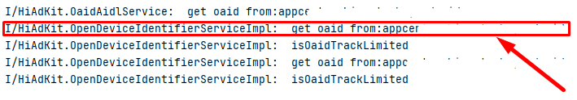

</p>

</br>

## <a name="track_event"></a> **3.Adjust.trackEvent() Methodu ile Olay Takibi**

<p>
Uygulama içerisinde yapmamız gereken bir diğer önemli işlem ise; Adjust Panelde oluşturulan olayları takip etmek için ilgili token’ların doğru yerlerde trackEvent methoduna parametre olarak verilme işlemidir.

</br>

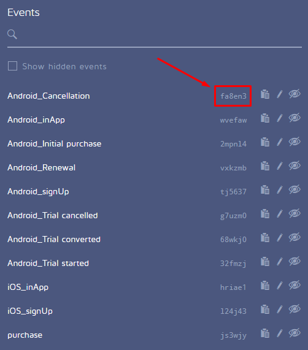

</br>

Java
```java
AdjustEvent adjustEvent = new AdjustEvent("abc123");
Adjust.trackEvent(adjustEvent);
```
Kotlin
```kotlin
val adjustEvent = AdjustEvent("abc123")
Adjust.trackEvent(adjustEvent)
```
</p>

</br>

## <a name="adjust-panel-side"></a> **Panel Taraflı İşlemler**
<p>
Adjust ile Huawei Reklam Servisinin birlikte çalışabilmesi için hem Adjust hem de Huawei Ads Panellerinde bazı işlemler yapmamız gerekir. Öncelikle Adjust Panel taraflı işlemlerle başlayalım.
</p>

</br>

## <a name="create_followers"></a> **1.Adjust Panel'de Huawei Ads için Takipçi Oluşturulması**

<p>
Adjust Panel’e giriş yaptıktan sonra yeni bir takipçi oluşturalım ve bunu Huawei Ads olarak isimlendirelim. Bunun için;
</p>

</br>

<p>
<b>Tracker URLs > New Tracker > Enter Tracker Name</b> ‘e gidin ve <b>“华为 广告 | Huawei Ads“</b> olarak isimlendirin.

</br>

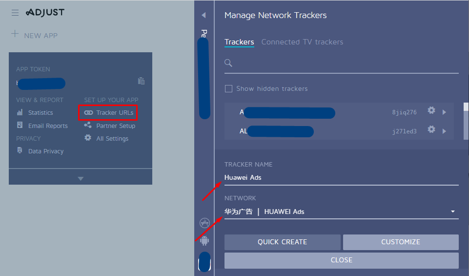
</p>

</br>

## <a name="click_impression"></a> **2. Click ve Impression URL'lerinin Oluşturulması**

<p>
Ardından <b>CUSTOMIZE > CREATE</b> ‘e tıklayın.

Click ve Impression URL’leri sırasıyla oluşacaktır.

<b>Not: Bu URL’leri Huawei Ads Platformuna eklenmek üzere not etmeyi lütfen unutmayın.</b>

</br>

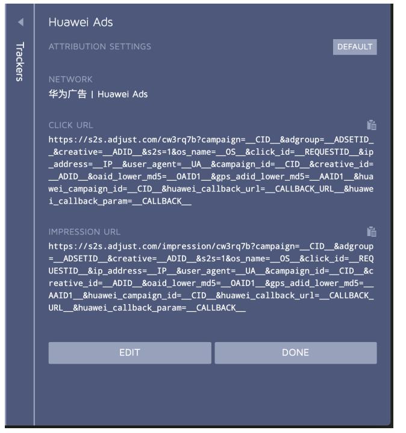
</p>

</br>

## <a name="Huawei_ads"></a> **3.Huawei Ads Panel'de Adjust için Ortalık Oluşturulması**

<p>
Huawei Ads Panel’e giriş yaptıktan sonra Adjust ile birlikte çalışacak alt yapıyı kurmak üzere bir ortaklık oluşturmakla başlayalım. Bunun için;

<b>Tools > Delivery assistance > Associated tool</b> menüsüne gidin ve New’e tıklayın.

</br>

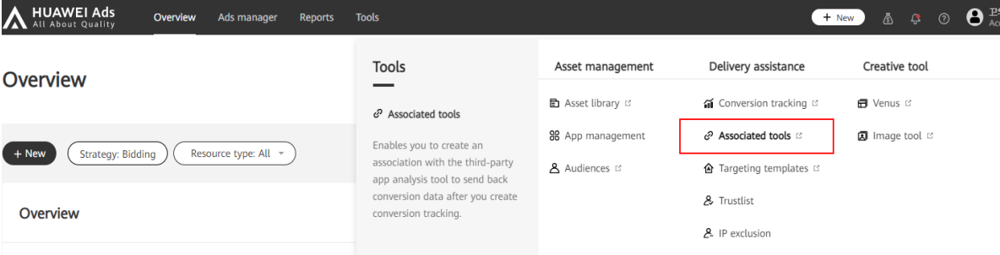
</p>

</br>

<p>
Açılan sayfada;

   - Tool provider olarak Adjust’ı,

   - App olarak ilgili uygulamanızı seçiniz.

   - Impression tracking URL ve Click tracking URL alanlarını Adjust Panelden aldığınız URL’ler ile doldurun ve <b>Submit</b> butonuna tıklayın.

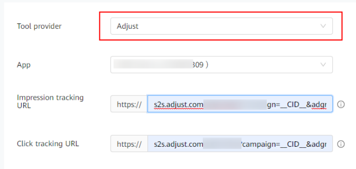

</p>

</br>

<p>
Submit işleminden sonra karşınıza gelen listede bulunan Key değerini Adjust Panel’e eklememiz gerekiyor. 

</br>

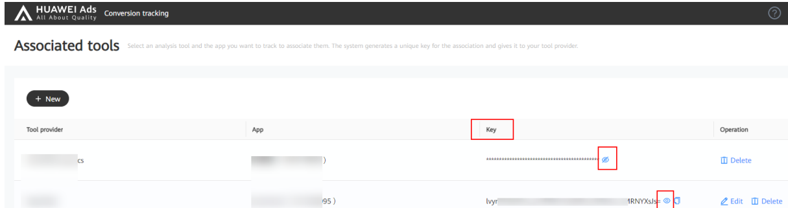

</p>

</br>

## <a name="secretkey"></a> **4.SecretKey Değerinin Adjust Panel'e Girilmesi**

<p>
Adjust Panel’e geri dönelim ve <b>Partner Setup > Add Partner</b> ‘e gittikten sonra Huawei Ads’i arayalım.

Uygulama platformu doğru şekilde seçtikten sonra <b>SECRETKEY</b> alanına bir önceki aşamada aldığımız Key’i girip Save butonuna tıklayalım.

</br>

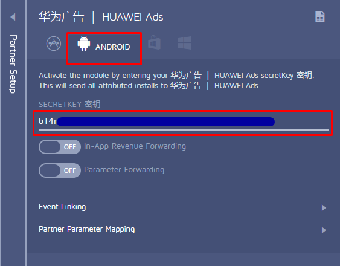
</p>

</br>

## <a name="Conversion_tracking"></a> **5.Huawei Ads Panel'de Dönüşüm Takibi Oluşturulması**

<p>
Takip ve analiz edilmesi istenen dönüşüm aksiyonlarını hem Huawei Ads Paneline hem de Adjust paneline tanımlamamız gerekiyor. Öncelikle Huawei Ads Paneline geçelim;

   - <b>Tools > Delivery assistance > Conversion tracking</b> menüsünde bulunan New conversion’a tıklayalım.

   - Önce App tracking’i sonra Analysis tool’u seçelim ve <b>Contiune</b> butonuna tıklayarak devam edelim.

   - Karşımıza çıkacak olan formu doldurarak takip etmek istediğimiz aksiyonlar için dönüşüm oluşturalım.

   </br>

   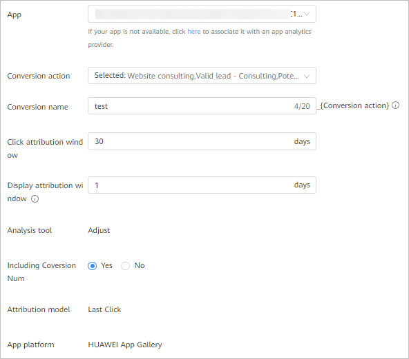

</p>

</br>

<p>

   - <b>App:</b> Takip etmek istediğiniz uygulamanızı seçiniz.

   - <b>Conversion actions:</b> Hangi konularda dönüşüm aksiyonları almak istediğinizi seçin.

   - <b>Conversion name:</b> Oluşturmak üzere olduğunu dönüşüme kolay anlaşılabilir bir isim verin.

   - <b>Click attribution window:</b> Reklam tıklandıktan ve dönüşüm oluşturulduktan sonraki periyottur. Varsayılan değeri 30 gündür ve bu değer Submit işleminden sonra değiştirilemez.

   - <b>Display attribution window:</b> Dönüşümün başlatılmasını sağlayan reklam izlenimi sonrası periyottur. Varsayılan değeri 1 gündür ve bu değer Submit işleminden sonra değiştirilemez.

   - <b>Including Conversion Num:</b> Dönüşüm aksiyonları için tanımladığınız her bir aksiyon için sayaç değeri tanımlayabilirsiniz. Örneğin uygulamanızda sepete ekleme işlemi 3, satın alma işlemi 2 kez gerçekleştiyse Conversion Num değeri size 5 olarak dönecektir.
</p>

</br>

<p>
Conversion actions tablosu:

</br>

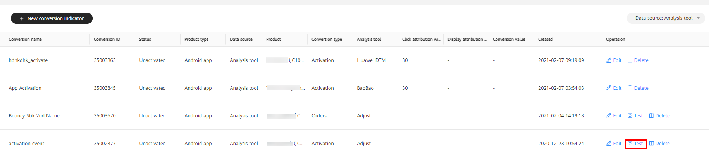

</br>

Tümü için bakınız;
https://developer.huawei.com/consumer/en/doc/distribution/promotion/tracking-shu-0000001139892541#EN-US_TOPIC_0000001139892541__table10838115914391 

</p>

</br>

<p>
Eklediğiniz her Conversion için Status sütunu altında <b>«Unactivated»</b> durumunu göreceksiniz. Bu durum şu an için normaldir, aktivasyon işlemine ilerleyen aşamalarda başlamış olacağız.

</br>

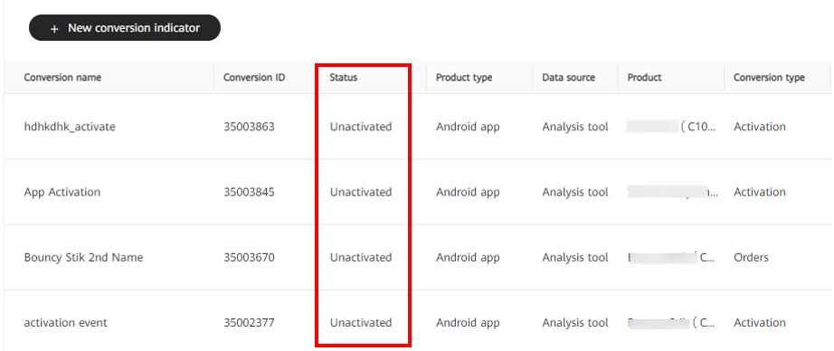
</p>

</br>

## <a name="event_linking"></a> **6.Adjust Panel'de Dönüşümleri Takip Edecek Olayların Oluşturulması ve Linklenmesi**

<p>
Huawei Ads Panel’e eklenen dönüşüm aksiyonlarının Adjust Panel’ine de eklenmesi gerekmektedir.

Bunun için Adjust Panel’e geri dönmeli ve <b>Partner Setup > Add Partner</b> alanında <b>“华为广告 | HUAWEI Ads”</b> i bulup seçmeliyiz ve aksiyonları birbirine eşitlemek için Event Linking alanını kullanmalıyız.

</br>

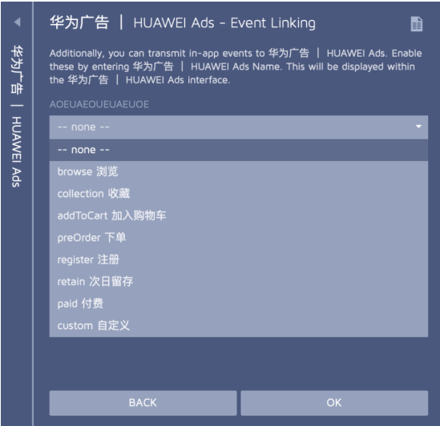

</br>

<b>Not: Adjust «Install» olayını otomatik eklediği için sizin ayrıca eklemeniz gerekmez.</b>

<b>Not 2: Adjust tarafındaki «Install» olayı Huawei Ads Panel tarafındaki «Activation» olayına karşılık gelmektedir.</b>

</p>

</br>

## <a name="conversion_test"></a> **7.Huawei Ads Panel'de Dönüşüm Takibi İçin Test İşlemlerinin Yapılması**

<p>
Eklediğiniz her Conversion için «Unactivated» olan durumunu aktive etmek için öncelikle Test işlemine tabii tutmamız gerekiyor bunun için ilgili satırın sağında bulunan Test linkine tıklıyoruz.

</br>


</p>

</br>

<p>
Açılan ekranda sizden test etmek istediğiniz cihazın OAID değerini girmenizi isteyecek. 

</br>

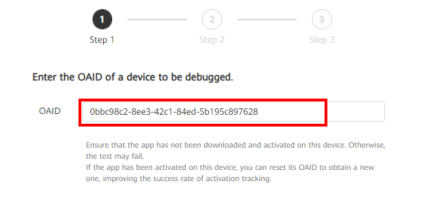

</br>

Bu değeri Huawei cihazınızda şu yolu takip ederek bulabilirsiniz;

<b>Privacy > Ads and Privacy > More information</b>

</br>

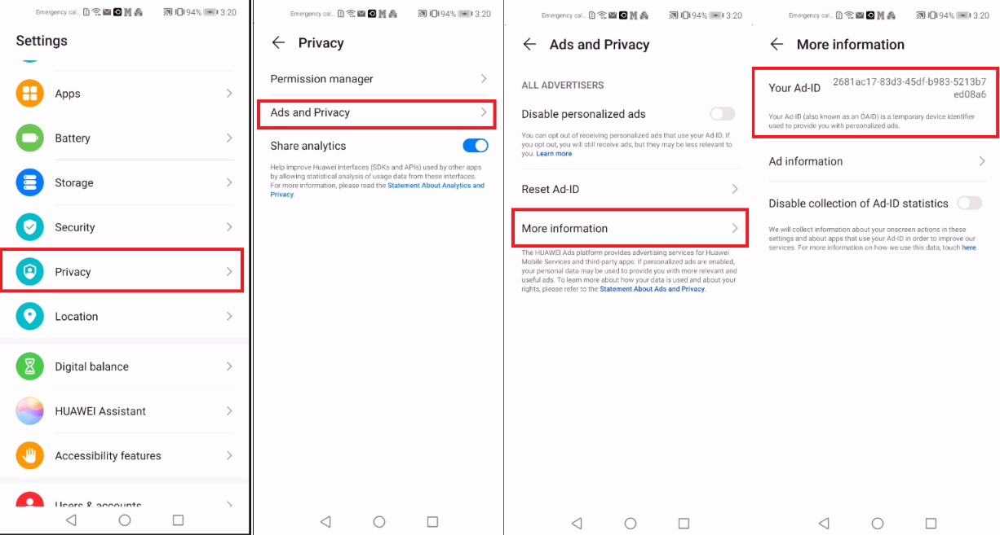

</br>

Burada gördüğünüz Ad-ID sizin OAID’inizdir.

</p>

</br>

<p>
İkinci aşamada sizden QR’u okutup uygulamayı indirmenizi isteyecektir. Bu işlemi tamamlayıp cihazınızdan uygulamayı açmanız gerekmektedir. 

</br>

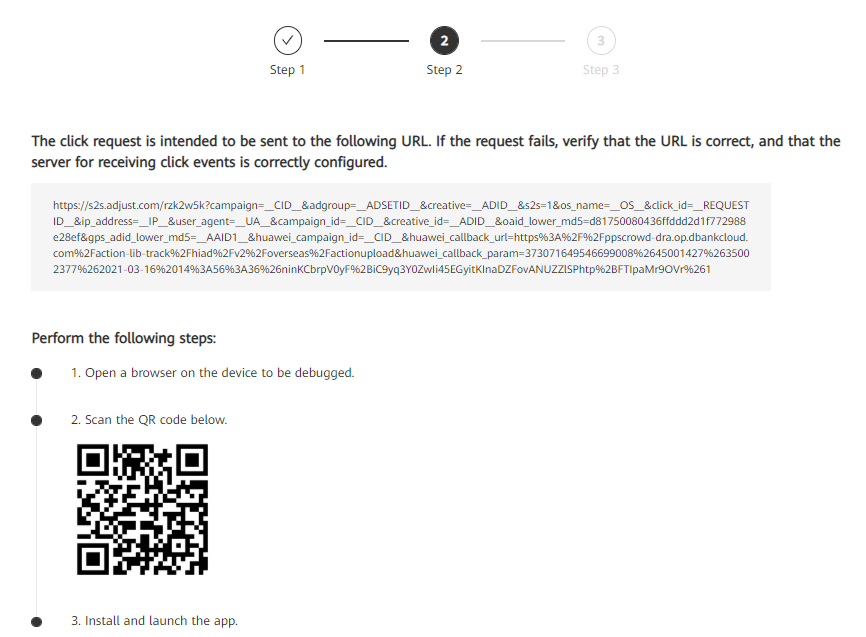

</p>

</br>

<p>
Üçüncü ve son aşama sizden test etmek istediğiniz Conversion’ı uygulama içerisinde tetiklemenizi bekler. Örneğin «addToCart» için bir dönüşüm eklediyseniz uygulama içerisinde bir ürünü sepete ekleyerek bu dönüşümü test etmeniz gerekir. Test işlemi tamamlandıktan sonra conversion (dönüşüm) aktif hale gelecektir.

</br>

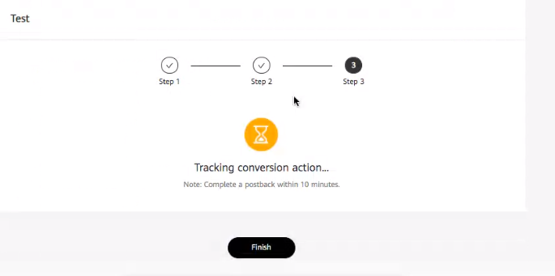

</p>

</br>

## <a name="adjust-sss"></a> **Adjust Sıkça Sorulan Sorular**


<p>
- Huawei Ads Panel ile Adjust Panel’deki Install sayıları birbirini neden tutmuyor?

+ Adjust Panel’de ki <b>“install”</b> sayılarını Huawei Ads Panel’de ki <b>“activation”</b> alanı ile karşılaştırmamız gerekmektedir.
</p>

</br>

<p>
- Adjust Panelinde “install” için bir event’i neden göremiyorum?

+ Install event’i Adjust Panelinde otomatik olarak eklenmiş / tanımlanmış olduğu için event listesinde görüntülenmemektedir.

</p>


<p>

[Genel soru cevap kısmı için](#common-sss)

</p>


## <a name="reference"></a> **Kaynakça**

- https://github.com/adjust/android_sdk/blob/master/doc/english/plugins/oaid.md

- https://developer.huawei.com/consumer/en/doc/distribution/promotion/adjust-0000001121931660

- [Adjust operation guide.pdf](assets/Adjust%20operation%20guide.pdf)

- https://medium.com/huawei-developers/adjust-third-party-tracking-integration-on-huawei-ads-platform-59a22dfdf033

</br>

# **AppsFlyer**

</br>

## <a name="appsflyer-client-side"></a> **Client Taraflı İşlemler**

<p>
AppsFlyer ve OAID işlemleri için öncelikle uygulama taraflı olan işlemleri tamamlamamız gerekmektedir. 

Bu işlemler; SDK implemente etmek, test için fonksiyon oluşturmak gibi basit bir kaç adımda tamamlanmaktadır.
   
</p>

<br>

## <a name="appsflyer-sdk"></a> **1. OAID için SDK'in Uygulamanıza İmplemente Edilmesi**


<br>

<p>
   <b>project:build.gradle</b> dosyanızda şu satırların olduğundan emin olunuz; 
</p>

```kotlin
allprojects {
  repositories {
    //...
    maven { url 'https://developer.huawei.com/repo/' }
    mavenCentral()
  }
}
```
<br>
<p>
   <b>app:build.gradle</b> dosyanızda Appsflyer SDK bağımlılığının altında şu satırların  olduğundan emin olunuz;
</p>

```kotlin
dependencies{
   //...
   implementation 'com.appsflyer:af-android-sdk:6.2.3@aar'
   implementation 'com.appsflyer:oaid:6.2.4'
   implementation 'com.huawei.hms:ads-identifier:3.4.39.302'
}
```
<br>

<p>
   Daha sonrasında Application sınıfının onCreate metodunda <b>init</b> ve <b>start</b> kodlarını, log dinleme işlemi için ise <b>setDebugLog</b> kodunu eklemelisiniz.
</p>
<br>

```kotlin
AppsFlyerLib.getInstance().init(<AF_DEV_KEY>, null, this)
AppsFlyerLib.getInstance().start(this)
AppsFlyerLib.getInstance().setDebugLog(true)
```

<br>

<p>
Aşağıda bir örnek görebilirsiniz.
</p>

<br>

<b>Java</b>
```java
import android.app.Application;
import com.appsflyer.AppsFlyerLib;
// ...
public class AFApplication extends Application {
    // ...
    @Override
    public void onCreate() {
        super.onCreate();
        // ...
        AppsFlyerLib.getInstance().init(<AF_DEV_KEY>, null, this);
        AppsFlyerLib.getInstance().start(this);
        // ...
    }
    // ...
}
```
<b>Kotlin</b>
```kotlin
import android.app.Application
import com.appsflyer.AppsFlyerLib
// ...
class AFApplication : Application() {
    override fun onCreate() {
        super.onCreate()
        // ...
        AppsFlyerLib.getInstance().init(<AF_DEV_KEY>, null, this)
        AppsFlyerLib.getInstance().start(this)
        // ...
    }
    // ...
}
```

<br>

## <a name ="appsflyer-oaid-values"></a> **2. setCollectOaid() Methodu ile OAID değerinin AppsFlyer'a Bildirilmesi**

<p>
Bu aşamada, eğer AppsFlyer SDK versiyonunuz <b>6.2.3</b> ya da üzeri ise, cihazın OAID verisini elde etmek için yapmanız gereken ek bir işlem yoktur. Fakat daha düşük bir SDK versiyonu kullanıyorsanız aşağıdaki kod satırını da Application sınıfının onCreate metoduna eklemelisiniz.
</p>

<br>

```kotlin
AppsFlyerLib.getInstance().setCollectOaid(true)
```
<br>

<p>
Tüm bu işlemlerin doğru bir şekilde yapılıp yapılamadığını test edebilmek için bir log dinleme işlemi var. İşlemler doğru yapıldıysa Android Studio’da Logcat’i Verbose seviyesine getirip <b>“oaid”</b> olarak filtreleme yapıldığında, aşağıdaki gibi bir log görmelisiniz. <b>“get oaid from:”</b> kısmından sonra uygulamanızın paket adı gelmektedir.
</p>


## <a name="appsflyer-track-event"></a> **3. trackEvent() Methodu ile Olay Takibi**

<p>
Uygulama içerisinde yapmamız gereken bir diğer önemli işlem ise; AppsFlyer Panelde oluşturulan eventleri takip etmek için, ilgili eventleri doğru yerlerde trackEvent methoduna parametre olarak verilme işlemidir.
</p>
<br>

<b>Java</b>
```java
      Map<String, Object> eventValues = new HasMap<>();
      eventValues.put(AFInAppEventParameterName.REVENUE, 1.99);
      eventValues.put(AFInAppEventParameterName.CURRENCY, "USD");
      AppsFlyerLib.getInstance().trackEvent(getApplicationContext(), APInAppEventType.PURCHASE, eventValues);
```


<b>Kotlin</b>
```kotlin
val eventValues: MutableMap<String, Any> = HasMap()
        eventValues[AFInAppEventParameterName.REVENUE] = 1.99
        eventValues[AFInAppEventParameterName.CURRENCY] = "USD"
        AppsFlyerLib.getInstance()
            .trackEvent(applicationContext, APInAppEventType.PURCHASE, eventValues)
```

## <a name="appsflyer-panel-side"></a> **Panel Taraflı İşlemler**
<p>
Client tarafındaki işlemler tamamlandıktan sonra sırada iki panelin de birbirleri ile iletişim kurabilmeleri için panel tarafındaki entegrasyon işlemlerinin yapılması gerekmektedir.
</p>

<br>

## <a name="appsflyer-tracker"></a> **1. AppsFlyer Panel'de Huawei Ads için Takipçi Oluşturulması**

<p>
AppsFlyer Panel’e giriş yaptıktan sonra yeni bir takipçi oluşturalım ve bunu Huawei Ads olarak isimlendirelim. Bunun için; <br>
   <b>AF integrated Partners > Huawei Ads Global > Integration</b>
</p>

<br>


<br>

## <a name="appsflyer-urls"></a> **2. Click ve Impression URL'lerinin Oluşturulması**

<p>
Huawei Ads ve AppsFlyer panellerinin birbirleriyle iletişim halinde olabilmeleri için panel tarafında birkaç entegrasyon işlemi yapılması gerekmektedir. Öncelikle AppsFlyer panelde Click ve Impression URL’lerinin oluşturulması gerekmektedir. Bunun için; <br>
</p>


<br>

<p>
   <b>Configuration > Integreted Partners > Attribution Link</b> adımları takip edilerek <b>Click</b> ve <b>Impression</b> URL'ler oluşturulabilir.
</p>

<br>

## <a name="appsflyer-huawei-partner"></a> **3. Huawei Ads Panel'de AppsFlyer için Ortalık Oluşturulması**
<p>
Daha sonrasında oluşturulan Click ve Impression URL’ler Huawei Ads paneline eklenmelidir. Bunun için;

<b>Tools > Delivery assistance > Associated tool</b> menüsüne gidin ve <b>New</b>’e tıklayın.
</p>

<br>


<p>
 <b>Tool provider kısmında AppsFlyer, App kısmında ise uygulamanız seçilmelidir.</b>
 </p>

<br>


<br>

## <a name="appsflyer-huawei-enter-secret-key"></a> **4. SecretKey Değerinin AppsFlyer Panel'e Girilmesi**

<br>

<p>
Huawei Ads paneline bu veriler girildikten sonra bir adet <b>KEY</b> değeri elde ediceksiniz.
</p>

<br>


<br>

<p>
   Bu <b>KEY</b> değerini alıp AppsFlyer paneline girmelisiniz.
</p>

<br>


<br>

## <a name="appsflyer-huawei-conversion-tracking"></a> **5. Huawei Ads Panel'de Dönüşüm Takibi Oluşturulması**

<br>

<p>
Bu işlemlerin ardından paneller arasındaki işlemler bitmiş olup, takip ve analiz edilmesi istenen dönüşüm aksiyonlarını hem Huawei Ads Paneline hem de Adjust paneline tanımlamamız gerekiyor. Öncelikle Huawei Ads Paneline geçelim;

<b>Tools > Delivery assistance > Conversion tracking</b> menüsünde bulunan New conversion’a tıklayalım.
Önce App tracking’i sonra Analysis tool’u seçelim ve Contiune butonuna tıklayarak devam edelim.
Karşımıza çıkacak olan formu doldurarak takip etmek istediğimiz aksiyonlar için dönüşüm oluşturalım.

</p>

<br>


<p>
<b>App:</b> Takip etmek istediğiniz uygulamanızı seçiniz.

<b>Conversion actions:</b> Hangi konularda dönüşüm aksiyonları almak istediğinizi seçiniz.

<b>Conversion name:</b> Oluşturmak üzere olduğunu dönüşüme kolay anlaşılabilir bir isim veriniz.

<b>Click attribution window:</b> Reklam tıklandıktan ve dönüşüm oluşturulduktan sonraki periyottur. Varsayılan değeri 30 gündür ve bu değer Submit işleminden sonra değiştirilemez.

<b>Display attribution window:</b> Dönüşümün başlatılmasını sağlayan reklam izlenimi sonrası periyottur. Varsayılan değeri 1 gündür ve bu değer Submit işleminden sonra değiştirilemez.

<b>Including Conversion Num:</b> Dönüşüm aksiyonları için tanımladığınız her bir aksiyon için sayaç değeri tanımlayabilirsiniz. Örneğin uygulamanızda sepete ekleme işlemi 3, satın alma işlemi 2 kez gerçekleştiyse Conversion Num değeri size 5 olarak dönecektir.

<b>Huawei Conversion actions tablosu için bakınız:</b>
https://developer.huawei.com/consumer/en/doc/distribution/promotion/tracking-shu-0000001139892541#EN-US_TOPIC_0000001139892541__table10838115914391 
</p>

<br>

## <a name="appsflyer-add-conversion"></a> **6. AppsFlyer Panel'de Dönüşümleri Takip Edecek Olayların Oluşturulması**

<br>

<p>
Daha sonrasında Huawei Ads panelinde oluşturulan conversion'ların karşılıkları Appsflyer panelde de oluşturulmalıdır.
</p>


<br>

## <a name="appsflyer-test"></a> **7. Huawei Ads Panel'de Dönüşüm Takibi İçin Test İşlemlerinin Yapılması**

<p>
Kampanyaya başlayabilmeniz için Huawei Ads tarafına eklenen conversion'ların aktif olması gerekmektedir. Conversion ilk eklendiğinde bu değer pasif durumdadır. Bunu aktif edebilmek için ise eilgili conversion'ı test işleminden geçirmek gerekiyor. Testi başarılı bir şekilde geçtiğinde conversion aktif olacaktır.
</p>

<br>


<p>
   <b>Bunun için öncelikle sağ tarafta bulunan “Test” butonuna tıklayınız.</b>
</p>

<br>


<p>
   <b>Daha sonrasında açılan panele test yapılacak cihazın OAID verisi girilmelidir.</b>
</p>

<br>


<br>

<p>
<b>Cihazınızın OAID verisini şu şekilde öğrenebilirsiniz. Privacy > Ads and Privacy > More Information > Your Ad-ID</b>
</br>


<br>

<p>
   <b>OAID verisi girildikten sonra karşınıza gelen karekod ile uygulamayı indirmeniz gerekmektedir.</b>
</p>


<br>

<p>
<b>Daha sonrasında ise test edilen conversion hangisi ise o işlemin gerçekleştirilmesi gerekmektedir. Örnek vermek gerekirse register conversion'ı test ediliyorsa uygulamayı indirdikten sonra çalıştırıp, register işleminin gerçekleştirilmesi gerekmektedir.</b>
</p>

<br>


<br>

<p>
<b>Test işlemi başarılı olduktan sonra Huawei Ads panelinde conversion'ın artık aktif durumda olduğunu göreceksiniz. Bu aşamadan sonra teknik işlemler bitmiş olup, kampanyanıza başlayabilirsiniz.</b>
</p>

<br>


<br>

## <a name="appsflyer-appsflyer-sss"></a> **AppsFlyer Sıkça Sorulan Sorular**

<br>


<p>
- Neden Appsflyer panelde install verisi her zaman organik olarak görülüyor?

+ Dev key değeri yanlış olabilir. Eğer bu değer yanlış ise paid install verisi sayılmaz, dolayısıyla install organik olarak sayılır.
<p>

<br>

<p>
- AppsFlyer panelde Install verisi neden gözükmüyor?

+ Init ve start fonksiyonlarının Application sınıfında çağırıldığından emin olunuz.
<p>

<br>

<p>
- Neden loglarda 404 hatası alıyorum?

+ 404 hatası ID'nin doğru bir şekilde alınamadığıyla alakalıdır. applicationId verisinin build.gradle dosyası ile panelde aynı olduğundan emin olunuz.
<p>

<br>

<p>
- AppsFlyer panelde neden Revenue kısmını göremiyorum?

+ Bunun sebebi revenue parametresinin düzgün bir şekilde formatlanmamış olmasıdır. Revenue herhangi bir şekilde formatlanmamalıdır. Örnek format 1234.56 şeklinde verilebilir.
<p>

<br>

<p>
- Neden "AppsFlyer's SDK cannot send any event without providing devkey" şeklinde bir log görüyorum?

+ Bu log ```start``` fonksiyonuna ```dev_key``` parametresi verilmediğinde görülmektedir.
<p>

<br>

<p>
- Neden "Not sending data yet, waiting for dev key" şeklinde bir log görüyorum?

+ Bu log ```init``` fonksiyonuna ```dev_key``` parametresi olarak boş string verildiğinde görülmektedir.
<p>

<br>

<p>

[Genel soru cevap kısmı için](#common-sss)

</p>

<hr>

<br>
<br>

## <a name="common-sss"></a> **Sıkça Sorulan Sorular**

<br>

<p>
- Conversion testi aktif edilemiyor. Ne yapmalıyım?

+ Eğer bir Conversion (dönüşüm) aktive edilemiyorsa, test öncesi cihazınızın OAID değerini sıfırlayabilir ya da daha önce test için kullanılmamış bir cihaz ile test işlemini yeniden gerçekleştirmeyi deneyebilirsiniz.
<p>

<br>

<p>
- MSA’nın SDK’ini uygulamama implemente etmem gerekiyor mu?

+ Çin anakarası dışında yayınlanan uygulamalar için MSA’nın SDK’ini uygulamaya implemente etme gerekliliği yoktur. Adjust, AppsFlyer gibi şirketlerin sunduğu ek SDK’ler sayesinde HMS cihazlarda OAID verisine kolayca ulaşabilmektedir.
<p>

<br>

<p>
- Google tarafında bugüne kadar sorunsuz ilerliyorduk, şimdi neden OAID işlemlerini yapmamız gerekiyor?

+ GMS Core’a sahip cihazlarda cihaz ve kullanıcı aksiyonları takibi GAID (Google Ad ID) üzerinden yapılmaktadır. 2020 yılı sonrası üretilen Huawei cihazlarda GMS Core olmadığı için aynı işlemler HMS Core’a sahip cihazlar için OAID üzerinden yapılmalıdır.
<p>

<br>

<p>
- OAID entegrasyonu yapmak uygulama boyutumu yükseltir ya da performansını kötü yönde etkiler mi?


+ AppsFlyer, Adjust gibi takip platformlarının sunduğu OAID SDK’larının amacı sadece cihazdaki OAID verisine ulaşıp kendi core yapılarına bu veriyi taşımaktır. Bu sebeple oldukça hafif boyutlardadırlar.
Örneğin: AppsFlyer OAID SDK’i sadece 11 KB boyutundadır. Adjust için ise OAID işlemlerini yapan SDK’ın boyutu sadece 15 KB civarındadır.
<p>

<br>

<p>
- OAID işlemlerini yaptıktan sonra GMS cihazlarda test ederken log ekranında neden uyarı alıyorum?

+ OIAD işlemleri sadece HMS Core üzerinde çalışmaktadır. Bu yüzden HMS Core’a sahip olmayan cihazlarda bu uyarının görünmesi çok normaldir ve bir sorun olduğu anlamına gelmemektedir.
<p>

<br>

<p>
- Huawei Panel’de ki “Activation” ne anlama gelmektedir?

+ <b>Download:</b> Reklam tıklanması sonucu, uygulamayı indirilme sayısı.
+ <b>Install:</b> Reklam tıklanması sonucu, indirilme sonrası uygulama yüklenme sayısı.
+ <b>Activation:</b> Reklam tıklanma sonucu, indirilme ve yüklenme sonrası uygulamanın ilk kez açılma sayısı.

+ Uygulama indirilme ve yüklenme işlemlerinde uygulama çalışmamış / ayağa kalkmamış durumunda olduğu için Download ve Install değerlerini HMS Core ile Huawei Ads Panel üzerinden takip edebiliyoruz. Adjust ise Huawei için Activation olan olayı Install (yani başarıyla yüklenme) olarak adlandırmaktadır.
<p>

<br>

<p>
- Hem HMS hem de GMS servislerine sahip telefonlarda kullanıcının reklama tıklamasından sonraki yönlendirme işlemleri nasıl çalışacak?

+ Bu reklamın hangi sağlayıcıdan sağlandığı ile alakalı bir durumdur. Kullanıcının gördüğü ve tıkladığı reklamın sağlayıcısı Huawei ise, tıklama işleminden sonraki takip ve yönlendirme işlemleri Huawei için eğer reklam diğer bir sağlayıcıdan sağlanıyor ise bu işlemler o sağlayıcı için devam edecektir.
<p>

<br>

<p>
- AppGallery ile 3. Parti Takip Platformu panel sayıları birbirini neden tutmuyor?

+ Bu olayın bir çok sebebi olabilir. Örnek vermek gerekirse bir kullanıcı aynı Huawei hesabı ile hem telefonuna hem de tabletine uygulamanızı indirebilir. Bu Adjust gibi 3. Parti Takip platformları tarafında 2 indirme sayılırken mağaza tarafında 1 indirme sayılır.
Ya da başka bir örnekle eğer uygulamanız daha önceden 3. Parti Takip Platformu SDK’ini yüklemeden mağazaya çıkmışsa, daha sonra 3. Parti Takip Platformu entegre edip güncelleme çıktığında 3. Parti Takip Platformu tarafında tüm eski kullanıcılar yeni kullanıcı olarak sayılacaktır, market tarafında ise bu güncelleme olarak görülecektir.
Dolayısıyla market tarafında eski kullanıcılar yeni gibi görünmeyecektir. Bu sebeple uygulamanın büyüklüğüne göre ilk güncelleme sonrası haftalar, aylar boyunca sayılarda tutarsızlık olabilir.
<p>

<br>

<p>
- SDK implementasyonu yapılmasına rağmen neden sadece organik install sayıları görülüyor?

+ Bu durum büyük ihtimalle; Huawei Ads Panel ve üçüncü parti takip platformu arasındaki panel bağlantılarının yanlış yapılandırılmasından kaynaklanıyor olabilir.
Ayrıntılı bilgi için dokümandaki paneller arası işlemlerin tanıldığı kısımlara ve üçüncü parti takip platformlarının kendi dokümanlarını inceleyebilirsiniz.
<p>

<br>

<p>
- Neden Huawei Ads platformu ile 3. Parti takip platformlarının impression ve click sayıları farklı?

+ Click veya impression verileri, HUAWEI Ads SDK ile entegre edilmiş medya tarafından HUAWEI Ads’e ve üçüncü taraf izleme platformuna aynı anda bildirilir. Ağ paket kaybı olduğunda veri farkı oluşabilir. % 5 ile %10 arasındaki sayı tutarsızlığı normal olarak kabul edilir.
<p>

<br>

<p>
- Neden üçüncü parti takip platformundaki veriler HUAWEI Reklam raporlarındaki verilerden farklı?

+ Üçüncü parti takip platformundan geri gönderilen veriler için HUAWEI Ads, verileri sadeleştirme, dolandırıcılık önleme ve yeniden ilişkilendirme dahil olmak üzere bir dizi işlemle filtreler ve ardından nihai sonucu raporlar.
Bu sebeple HUAWEI Reklam raporlarındaki gösterge değerleri üçüncü taraf izleme platformundakilerden daha az olabilir.
<p>

<br>

<p>
- Neden üçüncü taraf izleme platformunda yükleme sayısı az veya 0 olarak görünüyor?

+ Üçüncü taraf izleme platformunun SDK’i talimatlara uygun olarak entegre edilmemişse ya da kullanılan versiyon çok düşükse OAID’ler toplanmaz ve HUAWEI Reklamlarından gelen çoğu dönüşüm yanlışlıkla organik trafik veya diğer trafik olarak sayılabilir.
<p>

## <a name="appsflyer-kaynakca"></a> **Kaynakça**

<br>

+ https://developer.huawei.com/consumer/en/doc/distribution/promotion/appsflyer-0000001122291488
+ https://support.appsflyer.com/hc/en-us/articles/360006278797-Android-OAID-implementation-in-the-SDK
+ https://dev.appsflyer.com/hc/docs/integrate-android-sdk
+ https://medium.com/huawei-developers-tr/oaid-huawei-ads-panel-ve-appsflyer-i%CC%87%C5%9Flemleri-f953a3604531